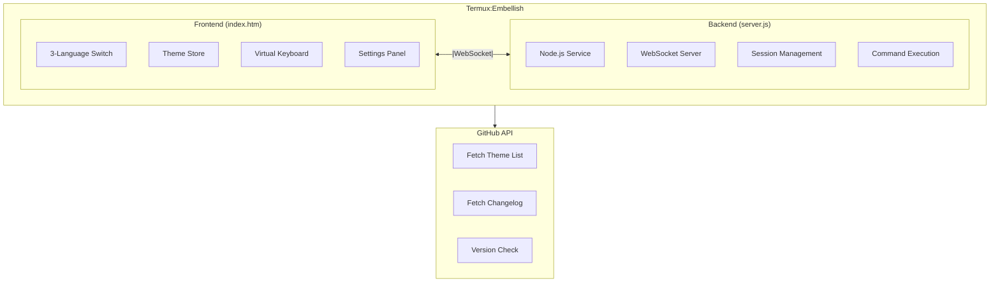

# Termux:Embellish

[](https://github.com/siyecao-meng/termux-embellish/stargazers)
[](https://github.com/siyecao-meng/termux-embellish/network)
[](https://github.com/siyecao-meng/termux-embellish/issues)

---

> A beautiful and feature-rich Web-based remote management tool for Termux.

## Features

- **Custom Themes** — Background image / colors / fonts, glassmorphism popup effects.
- **One-click Remote Access** — Cloudflare free tunnel, no public IP or domain required.
- **Local-only Data** — All data is stored locally. No user information is collected.
- **Shizuku Keep-alive** — Prevents Android from killing the background process.
- **Auto-start on Boot** — Works with Termux:Boot.
- **Desktop Shortcuts** — Works with Termux:Widget for one-click start/stop.

---

## 🚀 One-click Install

```bash
bash <(curl -sL https://raw.githubusercontent.com/siyecao-meng/termux-embellish/main/install.sh)
```

---

📖 Quick Commands

Command Description
embellish Start the main service
closh Launch Cloudflare remote tunnel
shish Keep-alive script
bootsh Auto-start on boot
widsh View desktop shortcuts
xiezai Uninstall everything

---

📌 Recent Updates (v1.0.2)

✨ New Features

· 🌐 3-Language UI — Chinese / English / Japanese
· 🎨 Theme Store — Online theme loading/unloading
· 📋 Changelog Popup — One-click update info
· 🔧 Request Settings — GitHub Token support

⌨️ Keyboard Improvements

· Auto-clear screen when keyboard opens, 30 fixed blank lines at bottom
· Auto-cleanup to 10 blank lines when keyboard closes

⚠️ Upgrade Notice

The signing key has been changed. Please uninstall v1.0.1 or earlier before installing this version.

---

📥 Download

Go to Releases to download platform-specific packages.

📦 Download here

---

🛠️ How It Works

Architecture Overview



Tech Stack

Module Technology
Frontend HTML5 + CSS3 + JavaScript
Backend Node.js + WebSocket (ws)
Remote Access Cloudflare Tunnel
Keep-alive Shizuku + Termux:Boot + Cron
Storage Local localStorage + JSON files

Core Principles

1. WebSocket Communication — Frontend connects to the Termux backend via WebSocket for real-time command I/O.
2. Session Management — Each session stores its command history independently in ~/.termux_sessions.json.
3. Theme Store — Theme list fetched from GitHub, CSS/JS loaded dynamically, user preferences stored locally.
4. Remote Connection — Uses cloudflared to create a temporary tunnel and generate a public HTTPS address.

---

👤 Author

Si Ye Cao (Four Leaf Clover)

· Little Red Book (Xiaohongshu): 5331041368
· Bilibili UID: 3706970185927059
· GitHub: @siyecao-meng

The author is 15 years old and still in school, so regular maintenance and updates cannot be guaranteed. Sorry for the inconvenience.

---

📸 Screenshots

https://raw.githubusercontent.com/siyecao-meng/termux-embellish/main/展示图片.png

https://raw.githubusercontent.com/siyecao-meng/termux-embellish/main/展示图片1.png

---

📄 License

This project is released under the MIT License.

Commercial use, modification, and redistribution are allowed, but proper attribution to the original author is required.
