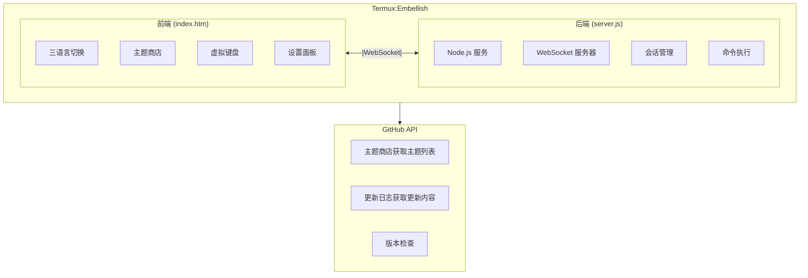

 
# Termux:Embellish
[](https://github.com/siyecao-meng/termux-embellish/stargazers)
[](https://github.com/siyecao-meng/termux-embellish/network)
[](https://github.com/siyecao-meng/termux-embellish/issues)

---

> 让 Termux 终端变得好看又好用的 Web 远程管理工具。


## 功能

-  **自定义主题** — 背景图片 / 颜色 / 字体，毛玻璃弹窗效果
-  **一键远程连接** — Cloudflare 免费隧道，无需公网 IP，无需域名
-  **数据全本地** — 所有数据仅保存在本地，不收集任何用户信息
-  **Shizuku 保活** — 防止安卓系统杀掉后台进程
-  **开机自启** — 配合 Termux:Boot 自动启动
-  **桌面快捷方式** — 配合 Termux:Widget 一键启动/停止

---


## 🚀 一键安装

```bash
bash <(curl -sL https://raw.githubusercontent.com/siyecao-meng/termux-embellish/main/install.sh)
```

---

## 📖 快捷命令

| 命令 | 功能 |
|------|------|
| `embellish` | 一键启动主服务 |
| `closh` | 启动 Cloudflare 远程隧道 |
| `shish` | 运行保活脚本 |
| `bootsh` | 启动开机自启 |
| `widsh` | 查看桌面快捷方式 |
| `xiezai` | 卸载全部 |

---
## 📌 近期更新 (v1.0.2)

### ✨ 新增功能
- 🌐 三语言切换 — 中文 / English / にちご
- 🎨 主题商店 — 支持在线装载/卸下主题
- 📋 更新日志弹窗 — 一键查看官方更新动态
- 🔧 服务请求配置 — 支持 GitHub Token

### ⌨️ 键盘优化
- 弹出键盘时自动清屏，底部固定30行空行
- 关闭键盘后自动清理并保留10行空行

### ⚠️ 升级须知
本版本更换了应用签名密钥，无法覆盖安装旧版本。请先卸载 v1.0.1 或更早版本，再安装本版本。

---
📥 下载

前往 Releases 下载对应平台安装包。

[📦 点此下载](https://github.com/siyecao-meng/termux-embellish/releases)

---
## 🛠️ 它是怎么实现的？

### 架构概览

### 技术栈

| 模块 | 技术 |
|------|------|
| 前端 | HTML5 + CSS3 + JavaScript |
| 后端 | Node.js + WebSocket (ws 模块) |
| 远程连接 | Cloudflare Tunnel |
| 保活 | Shizuku + Termux:Boot + Cron |
| 存储 | 本地 localStorage + JSON 文件 |

### 核心原理

1. **WebSocket 通信**  
   前端通过 WebSocket 连接 Termux 后端服务，实时收发命令和输出。

2. **会话管理**  
   每个会话独立存储命令历史，数据保存在 ~/.termux_sessions.json。

3. **主题商店**  
   从 GitHub 获取主题列表，动态加载 CSS/JS，用户偏好存本地。

4. **远程连接**  
   通过 cloudflared 创建临时隧道，生成公网 HTTPS 地址。
---
👤 作者

四叶草

· 小红书：5331041368

· B站 UID：3706970185927059

· GitHub：@siyecao-meng

· 由于作者15岁还在上学，可能无法做到定期维护和更新，可能有的时候一天更一个版本，有的时候几个星期更一个版本

---
## 软件图片展示:


---
📄 许可

本项目基于 MIT License 发布。

商用、二次创作、二次转载需标明原作者。

---
[English](https://github.com/siyecao-meng/termux-embellish/blob/main/English.md)
